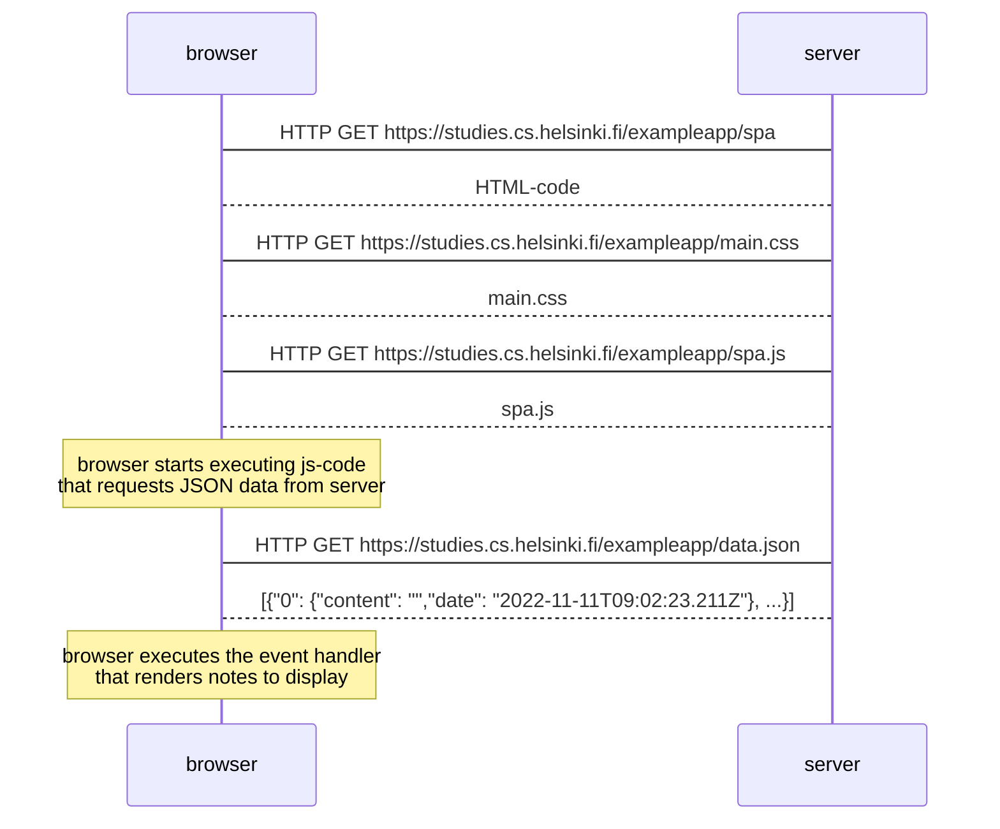

```mermaid
sequenceDiagram
# Get the HTML file for spa
browser->server: HTTP GET https://studies.cs.helsinki.fi/exampleapp/spa
server-->browser: HTML-code
# Retrieving style guide for .container and .notes
browser->server: HTTP GET https://studies.cs.helsinki.fi/exampleapp/main.css
server-->browser: main.css
# Retrieve the js script that parse json into list elements
browser->server: HTTP GET https://studies.cs.helsinki.fi/exampleapp/spa.js
server-->browser: spa.js

note over browser: browser starts executing js-code<br>that requests JSON data from server 

# Retrieve JSON data from the server
browser->server: HTTP GET https://studies.cs.helsinki.fi/exampleapp/data.json
server-->browser: [{"0": {"content": "","date": "2022-11-11T09:02:23.211Z"}, ...}]

note over browser: browser executes the event handler<br>that renders notes to display
```
